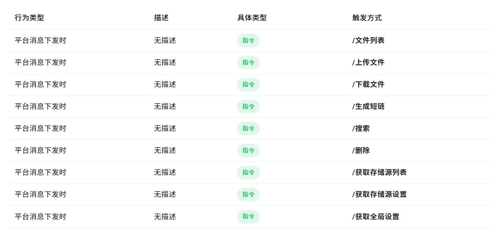
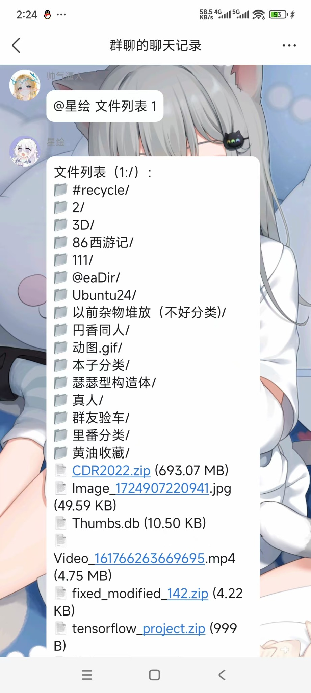
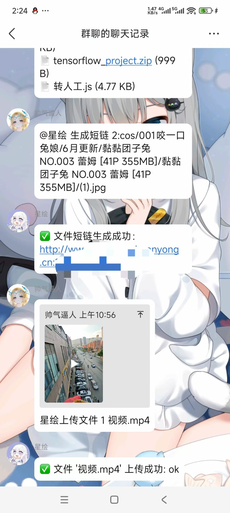

# astrbot_plugin_zfile

基于 [ZFile](https://github.com/zfile-dev/zfile) 项目开发的 AstrBot 插件，用于通过群聊指令远程管理文件，支持文件列表查看、上传下载、短链生成等操作。

本插件依托于 [cuckoo711/zfile_sdk](https://github.com/cuckoo711/zfile_sdk) 项目所提供的 ZFile API 封装，向其开发者表示特别感谢。

## 🌟 插件功能

通过群聊指令触发以下操作（详见下表）：

| 行为类型         | 描述   | 具体类型 | 触发方式            |
|------------------|--------|----------|---------------------|
| 平台消息下发时   | 无描述 | 指令     | `/文件列表`         |
| 平台消息下发时   | 无描述 | 指令     | `/上传文件`         |
| 平台消息下发时   | 无描述 | 指令     | `/下载文件`         |
| 平台消息下发时   | 无描述 | 指令     | `/生成短链`         |
| 平台消息下发时   | 无描述 | 指令     | `/搜索`             |
| 平台消息下发时   | 无描述 | 指令     | `/删除`             |
| 平台消息下发时   | 无描述 | 指令     | `/获取存储源列表`   |
| 平台消息下发时   | 无描述 | 指令     | `/获取存储源设置`   |
| 平台消息下发时   | 无描述 | 指令     | `/获取全局设置`     |

## 🧩 安装依赖

请使用以下命令安装必要依赖：

```bash
pip install zfile-pysdk==1.1.1
```

## 📷 插件演示

以下为本插件运行效果截图：

- 📁 文件列表展示：

  

- 🔗 短链生成与文件上传反馈：

  
  

## 🤝 感谢

特别感谢以下开源项目提供的底层支持：

- 🔗 [zfile-dev/zfile](https://github.com/zfile-dev/zfile)
- 🔧 [cuckoo711/zfile_sdk](https://github.com/cuckoo711/zfile_sdk)

---

如需集成此插件，请确保你已正确部署 ZFile 服务并获取其 API 地址与授权信息。插件可接入 AstrBot 平台，在群聊中提供灵活的文件管理能力。
